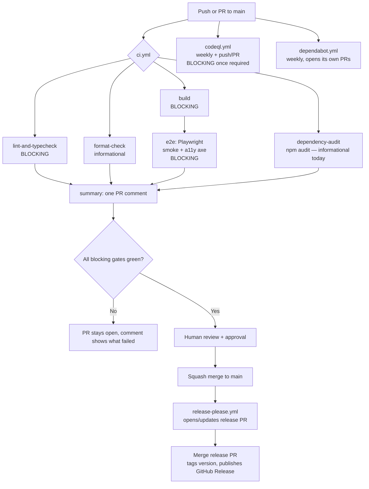

# OOH Earth — GitHub Engineering Pipeline: Audit & Architecture

**Scope:** the GitHub Actions / CI / branch / contributor layer only — how a change gets from a branch to a reviewed, validated, mergeable PR. This does not re-litigate the Base44 platform question (see `BASE44_MIGRATION_PLAN.md`); it assumes Dave keeps prototyping in Base44 and takes as given that "production engineering is managed in GitHub."

**Method:** every claim below comes from reading the actual workflow YAML and config files on `feature/engineering-pipeline` and `fix/phase1-runtime`, not from their descriptions. Nothing here is proposed from scratch — it's an audit of what already exists, unmerged, plus the precise gaps against the requested target pipeline.

**Headline finding:** this repository is **not yet ready** for its first GitHub Actions run in a production-gating sense — three branches share a fork point and haven't been reconciled — but the actual pipeline design is **already ~90% of the target list**, built and sitting unmerged on `feature/engineering-pipeline`. The remaining work is reconciliation and two small additions, not new infrastructure.

---

## 1. Engineering Pipeline Architecture

Two pipelines currently exist across branches, and they fully overlap:

| Workflow | Branch | Jobs |
|---|---|---|
| `build.yml` | `fix/phase1-runtime` (current), `main` | `npm ci` → lint → typecheck → build (lint/typecheck added this session) |
| `ci.yml` | `feature/engineering-pipeline` (unmerged) | 6 jobs: `lint-and-typecheck`, `format-check` (informational), `build` (+bundle-size artifact), `e2e` (Playwright smoke+a11y), `dependency-audit` (informational), `summary` (PR comment) |

**`ci.yml`'s own header comment says it directly: "Supersedes the old build-verify.yml."** This is a designed supersession, not an oversight — the fix is deleting `build.yml` in the same PR that merges `ci.yml`, not running both.

Alongside `ci.yml`, three more focused workflows exist on the same branch, each with a genuinely different trigger shape that doesn't fit cleanly into one file:

| Workflow | Trigger | Why separate |
|---|---|---|
| `codeql.yml` | push/PR to `main` + weekly cron (`17 3 * * 1`) | Needs its own `security-events: write` permission and a schedule trigger that doesn't belong mixed into a PR-gating workflow |
| `dependabot.yml` | Not a workflow — a config file GitHub's own bot reads | Weekly npm + GitHub Actions update PRs, grouped (`@radix-ui/*`, dev-dependencies) |
| `release-please.yml` | push to `main` only | Fires after merge, not during PR review — a different lifecycle stage entirely |

This shape (one consolidated PR-gate pipeline + separate security/dependency/release workflows) matches the instruction to prefer one consolidated pipeline over fragmentation — the existing separation is already principled, not accidental sprawl.

---

## 2. GitHub Actions Flow Diagram



**Two additions needed to match the requested target pipeline** (dependency install / lint / typecheck / build / Playwright smoke / accessibility / npm audit non-blocking-unless-high / CodeQL / **dependency review** / bundle size / PR summary):

1. **Dependency review is missing entirely.** `actions/dependency-review-action` is a distinct, official GitHub Action that flags newly-introduced vulnerable or license-incompatible dependencies *in a PR's diff specifically* — different from `npm audit` (scans the whole tree) and different from Dependabot (proactive, scheduled, not PR-scoped). Adding it is a single step inside the existing `ci.yml` (not a new workflow file — stays consolidated):
   ```yaml
   dependency-review:
     name: Dependency Review
     runs-on: ubuntu-latest
     if: github.event_name == 'pull_request'
     steps:
       - uses: actions/checkout@v4
       - uses: actions/dependency-review-action@v4
   ```
   No secrets needed — it uses the automatic `GITHUB_TOKEN`.

2. **`npm audit` is unconditionally informational**, not "non-blocking unless high/critical" as requested. Today's `dependency-audit` job has `continue-on-error: true` with no severity check at all. Closing this gap means parsing the JSON output and failing only above a threshold:
   ```yaml
   - name: npm audit (fail on high/critical only)
     run: |
       npm audit --omit=dev --json > audit-report.json || true
       HIGH=$(node -e "const r=require('./audit-report.json'); const m=r.metadata?.vulnerabilities||{}; console.log((m.high||0)+(m.critical||0))")
       echo "High/critical vulnerabilities: $HIGH"
       if [ "$HIGH" -gt 0 ]; then exit 1; fi
   ```
   This removes `continue-on-error: true` in effect (the step itself decides pass/fail), while still surfacing moderate/low findings informationally via the existing artifact upload.

Everything else in the target list — dependency install, lint, typecheck, build, Playwright smoke, accessibility (axe), CodeQL, bundle size report, PR summary — **already exists and works**, verified by reading the actual job definitions above.

---

## 3. Recommended branch strategy

Already fully designed in `BRANCHING_STRATEGY.md` on `feature/engineering-pipeline` — adopt as-is:

- Trunk-based. `main` is the only long-lived branch and must always be deployable (Base44 is still the runtime source of truth; `main` reflects what's safe to sync back).
- Short-lived branches: `feat/…`, `fix/…`, `chore/…`, `docs/…`.
- No direct commits to `main` — everything through a PR, including pipeline changes themselves.
- One concern per PR.
- Squash merge — the PR title becomes the commit message on `main`, which is what makes `release-please` reliable (it reads Conventional Commit messages from `main`'s history).

---

## 4. Required GitHub repository settings

| Setting | Where | Why |
|---|---|---|
| Actions: "Read and write permissions" (or explicit `pull-requests: write` scope confirmed) | Settings → Actions → General → Workflow permissions | `ci.yml`'s `summary` job posts/updates a PR comment — needs write access to pull requests |
| Code security and analysis: enable Dependabot alerts + security updates | Settings → Code security and analysis | Powers `dependabot.yml`'s alerts surface, separate from the PR-scoped `dependency-review` action |
| Code security and analysis: do **not** also enable "CodeQL default setup" | same page | `codeql.yml` is a custom, already-configured setup — enabling GitHub's automatic default setup alongside it would run CodeQL twice |
| `.github/CODEOWNERS` | repo root | Currently placeholder content per `feature/engineering-pipeline` — needs a real GitHub username before "require review from Code Owners" can be turned on |

---

## 5. Required branch protection rules

For `main`, once the branches above are merged and green (from `BRANCHING_STRATEGY.md`, unchanged):

- Require a pull request before merging (no exceptions, including admins).
- Require these status checks, up to date before merge:
  - `Lint & Typecheck`
  - `Build`
  - `Playwright (smoke + accessibility)`
  - `Analyze (javascript-typescript)` (CodeQL)
  - `Dependency Review` (once added per §2)
- Leave `Prettier (informational)` and `Dependency audit (informational)` **not required** — making them required today would block every PR immediately (291 files fail Prettier as of the last check; see §10).
- Require conversation resolution before merging.
- Require linear history (matches squash-merge).
- Disallow force pushes and branch deletion on `main`.
- Require review from Code Owners once `CODEOWNERS` has a real username (not enforceable with a single maintainer today — revisit when there's a second regular contributor).

**Note:** applying these requires GitHub repository admin access via the Settings UI or API. No session so far — including this one — has had that access; this section is instructions for a human, not something that can be verified as "done."

---

## 6. Required secrets/variables

**None.** This is worth stating explicitly: every job in the target pipeline (dependency install, lint, typecheck, build, Playwright smoke/a11y, npm audit, CodeQL, dependency review, bundle size, PR summary) runs without a live Base44 backend, without Stripe/crypto/n8n credentials, and without any repository secret. `CI_PIPELINE.md` already states this as a deliberate choice: CI has no live backend, so `Base44Error`/404 console noise is treated as expected offline behavior, not a failure. `dependency-review-action` and `codeql` both use the automatic `GITHUB_TOKEN` — no new secret needed for either addition in §2.

This is a genuinely good property to preserve: zero CI secrets means zero secret-rotation risk and zero chance of a leaked credential in workflow logs.

---

## 7. Local developer workflow

From `ENGINEERING.md`, unchanged:

| Command | What |
|---|---|
| `npm run dev` | Vite dev server |
| `npm run build` | Production build |
| `npm run lint` / `npm run lint:fix` | ESLint |
| `npm run typecheck` | `tsc` (jsconfig + tsconfig.ops) |
| `npm run format` / `npm run format:check` | Prettier |
| `npm run test:e2e` | Playwright (smoke + accessibility) |

Build-verify-before-PR, from `CONTRIBUTING.md`:
```bash
npm run build > /tmp/b.log 2>&1; echo "BUILD EXIT: $?"; tail -3 /tmp/b.log
npm run lint
npm run typecheck
```
Running these locally first is faster than waiting on CI to find the same failure.

---

## 8. Founder workflow

Nothing about this pipeline changes how Dave prototypes. The intended loop, matching the stated current workflow:

1. Prototype rapidly in Base44 + Claude, same as today.
2. When something needs to become production-grade (a real fix, a launch-critical feature, anything with blast radius), it moves into this repo as a branch.
3. The pipeline validates it (lint, typecheck, build, Playwright, a11y, security scans) without needing a live backend or any secret.
4. Dave reviews the PR and its CI summary comment, approves, squash-merges.
5. `main` reflects the change; how it syncs back into the live Base44 app depends on the two-way mirror's actual sync mechanics, which aren't visible from this repository alone — worth confirming directly with Base44's own docs/support rather than assuming a direction here.

The pipeline is a gate on the "production engineering" side of the loop, not a replacement for the Base44 prototyping side of it.

---

## 9. Contributor workflow

From `CONTRIBUTING.md`, unchanged — the load-bearing rules for anyone (human or agent) touching this repo:

- **The BACKUP-first rule**: nothing risky (new functions, migrations, data-touching fixes) touches production until proven on the BACKUP/sandbox environment first.
- **Secrets live in the environment only** — `Deno.env.get("SECRET_NAME")` in functions, never hardcoded, never committed.
- **Mind pagination** — `entity.list()` defaults can silently undercount; paginate explicitly for full sweeps.
- **Build-verify before every PR** (§7).
- **PR conventions**: branch from `main`, short descriptive name, one concern per PR, Conventional Commit title (drives `release-please`), fill the PR template, note any production/data implications explicitly.

---

## 10. Exact remaining work before the first production-ready PR

In order:

1. **Merge `engineering/baseline`** (lint 7→0, typecheck 1,153→0). Prerequisite — without it, the pipeline's blocking gates go red on the very first real PR through no fault of that PR's author.
2. **Reconcile `fix/phase1-runtime` against `engineering/baseline` by hand** on the files both touched (`Globe3D.jsx`, `Support.jsx` at minimum) — they fixed some of the same bugs independently and differently; this needs a human comparing the actual diffs, not an automatic merge.
3. **Merge `feature/engineering-pipeline`**, deleting `build.yml` in the same PR (exact duplicate of `ci.yml` once it lands).
4. **Update `e2e/a11y-baseline.json`** — it currently records `aria-hidden-focus` on `/about` as pre-existing debt. `fix/phase1-runtime` already fixed that specific violation; if the baseline isn't updated, the regression gate will simply never notice a real fix already shipped, not fail — but it should reflect current reality, not stale debt.
5. **Add the `dependency-review` job** to `ci.yml` (§2, four lines, no new workflow file).
6. **Add severity-based failure to the `dependency-audit` job** (§2) so it matches "non-blocking unless high/critical" instead of unconditionally informational.
7. **Apply branch protection settings by hand** (§5) — needs GitHub admin access.
8. **Confirm Actions workflow permissions** allow PR comments (§4) — the `summary` job silently can't post without this.
9. **Fill in `CODEOWNERS`** with a real username once there's a second regular contributor.

Steps 1–3, 5, and 6 are engineering/review time, not new infrastructure — realistically 1–2 weeks including PR review, most of it spent on step 2's manual reconciliation, not on writing new code. Steps 7–9 are one-time GitHub Settings actions for whoever has admin access, a few minutes each.

**Once steps 1–6 land, this repository's own pipeline satisfies the full ten-item target list stated in the task** — 8 of 10 items already work today via `ci.yml`, and the remaining 2 (dependency review, severity-gated audit) are additions of a few lines each to that same file, not new tooling.
