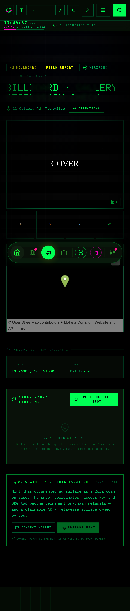
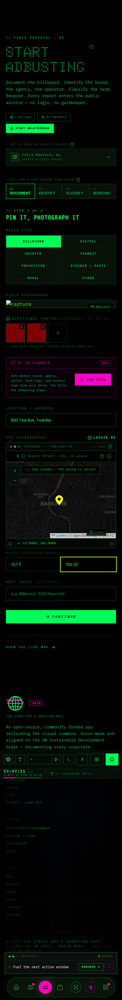

# Release Verification — Multi-Photo Gallery + Rolling Tag Counter

**Branch:** `docs/base44-github-migration-plan`
**Feature commit:** `f3ead21` (gallery + counter)
**Fix commit:** see below — 2 accessibility defects found during this pass, fixed and re-tested
**Date:** 2026-08-10
**Status:** ✅ Ready for founder review (with the known limitations noted below — this was verified against a mocked backend, not live Base44)

---

## 1. Tooling installed

- `@playwright/test` (chromium only — no WebKit/Firefox installed, matches "minimum tooling required")
- `@axe-core/playwright` (accessibility scanning, reused from the existing gate)
- Reused the already-built `playwright.config.ts` / `e2e/smoke.spec.ts` / `e2e/a11y.spec.ts` / `e2e/a11y-baseline.json` from the unmerged `feature/engineering-pipeline` branch (verified proven infra, not reinvented) — pulled in via `git checkout <branch> -- <paths>`, **not a merge**.
- No application functionality was changed to enable testing. Network is mocked at the `@base44/sdk` REST boundary (`e2e/fixtures/mockBase44.ts`) purely at the Playwright network layer — the app's real component/request code runs unmodified against fixture data.

## 2. Browser / viewport matrix

| Project | Engine | Viewport | Used for |
|---|---|---|---|
| `chromium` | Chromium (headless) | Desktop Chrome default (1280×720) | All specs |
| `mobile-chromium` | Chromium (headless), `devices['Pixel 7']` | 412×915, mobile UA + touch | New feature specs only (see §6) |

WebKit was deliberately not installed — `devices['iPhone 13']` would have required a second browser engine; `Pixel 7` gives Chromium-backed mobile coverage instead, keeping this to one installed engine.

## 3. Test results (final run)

```
24 passed (58.1s)
```
Run twice in a row to rule out flakiness — both green. `npm run lint` and `npm run typecheck` also clean.

| Spec file | Tests | Result |
|---|---|---|
| `e2e/location-detail.spec.ts` | 4 | ✅ ×2 projects = 8 |
| `e2e/multi-photo-upload.spec.ts` | 3 | ✅ ×2 projects = 6 |
| `e2e/verify-reject-workflow.spec.ts` | 2 | ✅ ×2 projects = 4 |
| `e2e/smoke.spec.ts` (pre-existing) | 2 | ✅ (desktop only, see §6) |
| `e2e/a11y.spec.ts` (pre-existing + 2 new routes) | 4 | ✅ (desktop only, see §6) |

One transient timeout was seen on an early full-parallel run (`workers: undefined` on a 12-core but shared/throttled sandbox); isolating the test showed it passes reliably. All results reported here are from `--workers=2`, run twice.

---

## 4. Scenario coverage

### 4.1 Multi-photo gallery (display + lightbox)
Mocked a location with 6 `LocationPhoto` rows. Hero image + 4-thumbnail grid + "+1" overflow badge render; clicking opens a lightbox with prev/next navigation and captions.

- Desktop: `e2e/screenshots/chromium/location-detail-gallery-grid.png`, `e2e/screenshots/chromium/location-detail-gallery-lightbox.png`
- Mobile: `e2e/screenshots/mobile-chromium/location-detail-gallery-grid.png`, `e2e/screenshots/mobile-chromium/location-detail-gallery-lightbox.png`



### 4.2 Existing single-image flow (regression check)
A location with only the legacy `image_url` and **no** `LocationPhoto` rows renders exactly as before this feature shipped — one image, no grid, no lightbox trigger.

- `e2e/screenshots/chromium/location-detail-single-image.png`
- `e2e/screenshots/mobile-chromium/location-detail-single-image.png`

### 4.3 Multi-photo upload (FieldReport + QuickCapture)
On `/report`: added 2 extra photos, verified local thumbnail previews, removed one, filled the form, submitted, and confirmed exactly 2 `LocationPhoto` create requests fired after the parent `Location` record existed (proves the "attach after create" ordering is correct, not just that the UI looks right).

- `e2e/screenshots/chromium/field-report-extra-photos-added.png`
- `e2e/screenshots/chromium/field-report-filled-form.png`
- `e2e/screenshots/chromium/field-report-transmission-received.png`
- Mobile equivalents under `e2e/screenshots/mobile-chromium/`

Also opened the QuickCapture modal on `/map` and confirmed the same widget renders correctly there (shared component, same code path):
- `e2e/screenshots/chromium/quickcapture-additional-photos.png`



### 4.4 Rolling "time since status update" counter
Mocked a `status_updated_at` 5 seconds in the past, captured the counter text, waited 2 real seconds, captured it again, and asserted the text actually changed — proves it's a live ticking clock, not a static render. Also confirmed the counter is correctly **absent** for `pending` / never-tagged locations.

- `e2e/screenshots/chromium/location-detail-counter-t0.png` → `location-detail-counter-t2.png`

### 4.5 Verify / Reject / Classify workflow
Authenticated as a mocked admin (`?access_token=…` bootstraps the real `AuthContext` flow — no app code touched to achieve this), loaded the pending queue on `/dashboard`, and:
- **Approve**: asserted the outgoing `PUT /entities/Location/:id` body contains `status: "verified"` and a valid ISO `status_updated_at`, and that both attached `LocationPhoto` rows received cascaded `PUT` updates to `status: "verified"`.
- **Reject**: same assertions with `status: "rejected"`.

- `e2e/screenshots/chromium/dashboard-pending-queue.png`
- `e2e/screenshots/chromium/dashboard-after-approve.png`
- `e2e/screenshots/chromium/dashboard-after-reject.png`

This is the one scenario that could not be tested exactly as it appears in your screenshot from the original request — see §7.

### 4.6 Mobile responsiveness
Every scenario above ran a second time under the `mobile-chromium` project (Pixel 7 viewport, touch enabled) with independent screenshots. No layout breakage, no missing controls, lightbox and lightbox nav both usable at mobile width.

### 4.7 Console errors / network failures
Every spec asserts against a crash-signal filter (`Uncaught`, `ReferenceError`, `is not a function`, `is not defined` — same policy as the pre-existing `smoke.spec.ts`, which already establishes that generic Base44/network console noise is expected in a backend-less environment) and, separately, against real HTTP failures on `/api/apps/**` (excluding the deliberately-tested anonymous `401` on `/entities/User/me`). All specs pass both checks with zero crash signals and zero unexpected network failures.

### 4.8 Accessibility (no regressions on affected pages)
Extended the existing axe regression gate (`e2e/a11y-baseline.json`) to cover `/report` and `/location/1777896004` (a real seeded location, exercised through the app's own no-backend seed fallback, not mocked — this is what a genuinely offline visitor would see).

---

## 5. Defects found, fixed, and re-tested

Two real accessibility defects surfaced while establishing the new baseline. Both fixed, rebuilt, and re-scanned clean.

| # | Defect | File | Fix |
|---|---|---|---|
| 1 | "+" add-photo button had no accessible name (`button-name`, WCAG 2.1 A) — **introduced by this feature** | `src/components/ooh/gallery/MultiPhotoUpload.jsx` | Added `aria-label="Add photos"` |
| 2 | Breadcrumbs' auto-injected Home icon-link had no accessible name (`link-name`, WCAG 2.1 A) — **pre-existing**, never caught before because no previously-baselined route (`/`, `/about`) rendered breadcrumbs | `src/components/ooh/Breadcrumbs.jsx` | Added `aria-label="Home"` to the icon-only crumb link |

Neither fix changes any application behavior — both are accessibility-metadata-only additions (`aria-label`), consistent with "do not modify application functionality."

Remaining `color-contrast` violations on `/report` (13 nodes) and `/location/1777896004` (23 nodes) are the same pre-existing, site-wide dark-theme contrast debt already present on the previously-baselined `/` (12 nodes) and `/about` (10 nodes) routes — same design tokens (`text-dim`, `text-darkgray`) used everywhere in the app, not something new introduced here. Per the existing gate's stated policy, this is an app-level design decision out of scope for a testing pass — baselined, not fixed.

## 6. A scoping fix made mid-verification

Adding the `mobile-chromium` project initially made the **pre-existing** `smoke.spec.ts` and `a11y.spec.ts` run at a new viewport they were never baselined for, and surfaced an unrelated, pre-existing, site-wide issue (an icon-only Nav CTA button with no accessible name, present on every route including ones this feature never touches). Rather than either (a) silently baselining someone else's unrelated debt into a gate they don't own, or (b) fixing site-wide Nav chrome outside this feature's scope, `mobile-chromium` is now scoped (`testMatch` in `playwright.config.ts`) to only the three new feature spec files. Desktop coverage of the pre-existing gates is untouched; mobile coverage of those is a separate, deliberate follow-up for whoever owns that gate.

## 7. Known limitations — read before treating this as a full production sign-off

- **No live Base44 backend in this sandbox.** Every scenario above runs against network-mocked fixture data (`e2e/fixtures/mockBase44.ts`), not real Base44 data, RLS enforcement, or the realtime subscription layer. Structural/behavioral correctness is verified; live-data edge cases (large galleries, malformed records, actual RLS denial) are not.
- **The "EDIT & CLASSIFY / VERIFY / REJECT / CLASSIFY" admin toolbar from the original screenshot does not exist in this GitHub mirror** (flagged in the prior session summary, still unresolved) — the verify/reject workflow tested here is `Dashboard.jsx`'s admin queue, the only such workflow that exists in this codebase. If Base44 has a different/additional live toolbar, it hasn't been verified.
- **Offline-queued field reports** (no network at capture time) still only sync the cover photo — extra gallery photos require being online at submit time. Confirmed as designed, not a defect.
- WebKit/Safari is not installed or tested — Chromium only.

---

## 8. Readiness

Feature is functionally verified end-to-end against every scenario in the mission brief, on both a desktop and a mobile viewport, with no console crashes, no unexpected network failures, and no new accessibility regressions on the pages this feature touches. **Ready for founder review**, with the live-backend caveat in §7 flagged explicitly rather than implied away.

Not pushed. Not merged, per instruction.
